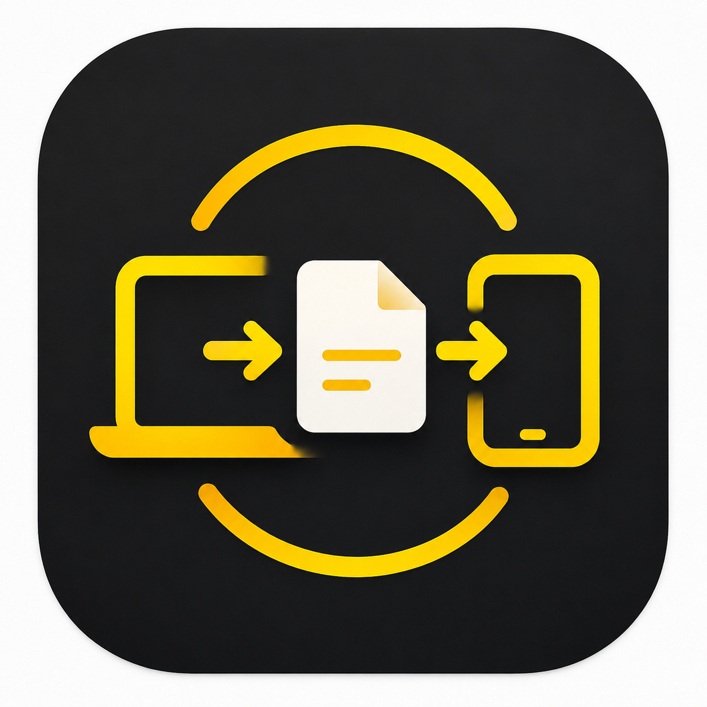

  
  
  # ☄️ Netbeam
  
  **Lightning Fast Local P2P File Transfer**
  

    
    
  

---

## 📖 Tentang Aplikasi
**Netbeam** adalah aplikasi desktop berkecepatan tinggi yang memungkinkan Anda untuk mentransfer file berukuran raksasa antar komputer dalam satu jaringan lokal (Wi-Fi / LAN) secara instan, tanpa memerlukan koneksi internet, tanpa kabel, dan tanpa perantara server luar. 

Dirancang dengan antarmuka yang sangat mudah dipahami sehingga siapa saja dapat menggunakannya.

---

## ✨ Fitur Unggulan
- **⚡ Super Cepat**: Memanfaatkan batas maksimal kecepatan router Wi-Fi atau kabel LAN Anda.
- **📡 Network Radar**: Tidak perlu pusing mencari IP Address. Fitur radar akan otomatis menemukan PC teman Anda di jaringan yang sama.
- **🛡️ Keamanan Privasi**: File yang masuk tidak akan otomatis tersimpan. Anda punya kendali penuh untuk Menerima (*Accept*) atau Menolak (*Reject*) setiap file dari pengirim.
- **📂 Multi-file Drag & Drop**: Tarik dan lepas puluhan file sekaligus dari *File Explorer* Anda langsung ke jendela aplikasi. Semuanya akan terkirim secara berurutan.
- **🧠 Transfer Memory**: Aplikasi secara otomatis mengingat riwayat transfer Anda dan menyimpan "Jalan Pintas" (*Recent Devices*) ke komputer yang paling sering Anda hubungi.
- **💬 Built-in Chat**: Berkomunikasi dengan singkat melalui fitur obrolan bawaan sembari menunggu file Anda terkirim.

---

## 🚀 Panduan Penggunaan
1. **Buka Netbeam** di kedua komputer (Pengirim & Penerima). Pastikan keduanya terhubung di Wi-Fi / jaringan yang sama.
2. Klik tombol **Start** pada panel "My Station" untuk mengaktifkan radar dan membuat PC Anda terlihat.
3. Di komputer Pengirim, perhatikan panel **Radar**. Nama PC Penerima akan muncul secara otomatis.
4. **Klik nama PC Penerima** di Radar, lalu klik tombol **Connect**.
5. Setelah terhubung, klik **Select & Send File** atau seret file Anda langsung ke jendela aplikasi.
6. Komputer Penerima akan menerima *Pop-up* persetujuan. Setelah diklik **Accept**, file akan meluncur seketika!

---

  Dibuat untuk memudahkan pertukaran data secara offline tanpa batas.

